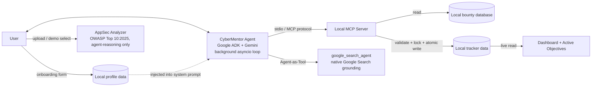

# CyberMentor Agent 🛡️
**Developed by:** Alanoud Khalid Al-Oraydi

**Track:** Concierge Agents · Kaggle "AI Agents: Intensive Vibe Coding Capstone"

🚀 **Video Presentation & Demo:** [Click here to watch the demo on YouTube](https://youtu.be/PyH1RrECYZs)

A personalized AI cybersecurity mentor with a professional AppSec-dashboard
UI. On first run it gets to know you (name, age, field of study), then
matches your skills to a real bug bounty or CTF objective — falling back
to a live web search if nothing local fits — tracks your progress on a
gamified dashboard, gives on-demand recon guidance and career
consultations, and audits code against the OWASP Top 10: 2025.

> **Note on data:** the local bounty database is a **mock dataset** for
> demo purposes. Organization names are flavored after real Saudi
> cybersecurity entities and platforms (BugBounty.sa, SDAIA, stc pay,
> ShiftZero, local university CSCs) purely for realism — none of it
> reflects real, active program terms.

---

## 1. Problem Statement

Cybersecurity learners constantly finish labs, courses, and workshops —
but hit a wall between "I just learned SQL injection" and a concrete next
step. They don't know which programs match their level, lose track of
what they've accepted, have no easy way to sanity-check code against the
latest OWASP guidance, and get generic advice that ignores who they
actually are.

## 2. Solution

**CyberMentor Agent** personalizes the entire experience from the first
screen:

1. A one-time onboarding form (name, age, profession/field of study)
   personalizes every recommendation the mentor makes afterward.
2. It recommends a matching bounty/CTF objective — searching the live web
   for real, active programs if the local curated list has no match — and
   tracks accepted objectives on a live dashboard (Planned / In Progress /
   Completed), with one-click status updates and a small celebration when
   you complete one.
3. **"🛡️ Help Me Solve"** gives an on-demand recon methodology per
   objective; **"🎓 Request Specialized Consultation"** recommends career
   paths and certifications based on your profile.
4. A built-in **AppSec Analyzer** audits uploaded or pasted code strictly
   against the **OWASP Top 10: 2025** and suggests a patch.
5. It refuses, deterministically and in its own reasoning, to ever reveal
   its own prompt, source files, or credentials — and never surfaces raw
   errors or internal file names to the user.

## 3. Architecture



- **UI + Agent process** (`agent.py`): a Streamlit app hosting a single
  Google ADK `Agent` backed by Gemini, gated behind a one-time
  personalization form. The chat panel and AppSec Analyzer live in
  separate tabs; a sidebar dashboard reads the tracker on every rerun.
- **Tool process** (`mcp_server.py`): a separate local process, spoken to
  over the **Model Context Protocol** via stdio. It owns all filesystem
  access and input validation — the agent process never touches local
  data files directly, and has **no tool at all** that can read arbitrary
  files (least-privilege by construction).
- **Search grounding**: a dedicated `google_search_agent`, wrapped as an
  `AgentTool`, sits alongside the MCP toolset on the root agent (see
  "Why Google Search is wrapped in a sub-agent" below).
- **AppSec Analyzer**: pure agent reasoning over user-supplied code — no
  MCP tool involved.

### Why Google Search is wrapped in a sub-agent, not added directly

ADK's built-in `google_search` tool cannot be safely mixed directly into
the same agent's `tools` list alongside custom/MCP tools — this is a
documented ADK/Gemini limitation. Depending on SDK/model version it can
raise `400 INVALID_ARGUMENT: Tool use with function calling is
unsupported` or `Multiple tools are supported only when they are all
search tools`. The documented, version-independent fix is the
**Agent-as-Tool pattern**: a dedicated `google_search_agent` that *only*
has the `google_search` tool, wrapped in an `AgentTool` and handed to the
root agent alongside the MCP toolset. That's what `get_agent_runtime()`
does — verified by construction-testing both the naive direct-mix
approach (works at construction time but is documented as failing at
call time in several ADK versions) and this pattern (the one actually
shipped).

### Bridging Streamlit's sync flow with ADK's async runner

Streamlit reruns the whole script synchronously on every interaction, but
ADK's `Runner` and the MCP stdio connection are async — and the MCP
subprocess connection is bound to whichever event loop was running the
first time it's used. `agent.py` solves this with a **single background
thread that owns one persistent `asyncio` event loop** for the life of
the server process (`BackgroundEventLoop`, cached via `st.cache_resource`
alongside the agent/runner/session service/toolset, keyed by profile so a
changed profile gets a freshly-personalized agent). Every coroutine —
conversational tool calls made by the LLM, and deterministic UI-triggered
calls like a sidebar status change — is submitted to that same loop via
`asyncio.run_coroutine_threadsafe`, so there is only ever one MCP
connection alive, no matter how many times Streamlit reruns the script.

## 4. Project Structure

```
cybermentor-agent/
├── agent.py             # Streamlit app: onboarding, theme, dashboard, tabs, scanner, self-protection
├── mcp_server.py        # MCP server: search_bounties, add_to_tracker, update_tracker_status
├── bounties.json        # Mock bounty/CTF database (5 objectives)
├── todo.json            # Tracker data (starts empty)
├── requirements.txt
├── .env.example
└── .gitignore
```

`profile.json` is created automatically on first run from the onboarding
form and is git-ignored (it contains personal data).

## 5. Setup Instructions

**Prerequisites:** Python 3.10+, a free Gemini API key.

```bash
# 1. Clone / unzip the project, then enter it
cd cybermentor-agent

# 2. Create and activate a virtual environment
python3 -m venv .venv
source .venv/bin/activate        # Windows: .venv\Scripts\activate

# 3. Install dependencies
pip install -r requirements.txt

# 4. Configure your API key (never hardcoded in source)
cp .env.example .env
# Edit .env and paste your key from https://aistudio.google.com/app/apikey

# 5. Run the app
streamlit run agent.py
```

On first launch you'll see a short onboarding form (name, age, profession
/ field of study) before anything else — the rest of the app is hidden
until it's completed. After that, Streamlit opens the dashboard
automatically (default: `http://localhost:8501`). You do **not** need to
launch `mcp_server.py` yourself — `agent.py` starts it automatically as a
local subprocess over stdio the first time a tool is called.

## 6. How the Mandatory Kaggle Criteria Are Implemented

### ✅ Agent System (ADK)
- `agent.py` defines a single `google.adk.agents.Agent` (`root_agent`)
  backed by Gemini (`gemini-2.5-flash`), driven by a `Runner` +
  `InMemorySessionService`. Its system prompt is built dynamically per
  user profile (`build_system_prompt`), and `st.cache_resource` keys the
  cached runtime by that same profile.
- All orchestration — deciding when to search locally vs. the live web,
  what to recommend, when the user has accepted, what to teach next, how
  to interpret a code scan or a consultation request — is delegated to
  the LLM's own reasoning. No hardcoded if/else dialogue tree.

### ✅ Web GUI (Streamlit) — Professional AppSec Dashboard
- Custom CSS theme: cool slate (`#F8FAFC`) in light mode, deep navy
  (`#0B1120`) in dark mode, switching automatically via
  `prefers-color-scheme` — no pure white anywhere. Chat messages and code
  blocks use `overflow-wrap: break-word` and `white-space: pre-wrap` so
  long lines never get cut off or force horizontal scrolling.
- **Onboarding gate**: `profile.json` is checked on every load; if it's
  missing or incomplete, only the onboarding `st.form` renders and the
  script calls `st.stop()` — the dashboard, tabs, and chat are completely
  hidden until a valid profile exists.
- **Two tabs**: `💬 Cyber Advisor` (chat) and `🔍 AppSec Analyzer (OWASP
  2025)` (code scanner), keeping the two workflows visually separate.
- **🛡️ Cyber Ops Dashboard** sidebar: **📊 Progress Metrics** (three live
  `st.metric` counters), **🎯 Active Objectives** (status dropdowns wired
  straight to the `update_tracker_status` MCP tool — completing one
  triggers `st.balloons()`), a **🛡️ Help Me Solve** button per objective,
  and a **🎓 Request Specialized Consultation** button that uses the
  profile to suggest career paths and certifications.
- **No internal file names anywhere in the UI.** Every caption, label, and
  message describes outcomes in plain language ("No objectives tracked
  yet", "Could not update your objective right now") instead of naming
  any local data file — deliberate defense-in-depth against
  reconnaissance-style information disclosure, independent of the
  technical access controls elsewhere in the app.

### ✅ MCP Server
- `mcp_server.py` is a standalone **Model Context Protocol** server built
  with the official `mcp` Python SDK (`FastMCP`), run over **stdio**,
  exposing `search_bounties`, `add_to_tracker`, and
  `update_tracker_status`. `agent.py` connects to it via ADK's
  `McpToolset`, and the Streamlit UI also calls tools directly through the
  same toolset for deterministic actions (status changes), bypassing the
  LLM entirely for speed and reliability.

### ✅ Sustainable Agentic Search (Google Grounding)
- If `search_bounties` returns zero local matches, the system prompt
  instructs the agent to call the `google_search_agent` tool (the
  Agent-as-Tool-wrapped native Google Search grounding tool) to find real,
  currently active bug bounty or CTF programs on the open web, clearly
  labeled as such and distinct from the local curated list.

### ✅ Security Features
- **Secrets management:** `GOOGLE_API_KEY` loads exclusively from `.env`
  via `python-dotenv`, never hardcoded, `.env` git-ignored.
- **4-layer input validation** in `mcp_server.py` (`_sanitize`, used by
  `add_to_tracker` and `update_tracker_status`): type/presence check;
  length + structural allow-list (`^[A-Za-z0-9\u0600-\u06FF\s_\-.,:()]+$`,
  rejecting shell metacharacters, path separators, quotes, control
  characters); a dangerous-pattern blocklist (`rm -rf`, `DROP TABLE`,
  `UNION SELECT`, etc.) plus a closed status enum; and a hardcoded,
  concurrency-safe atomic output path. Nothing ever crashes the server —
  rejected input returns `{"status": "security_alert", "message":
  "SECURITY ALERT: Input rejected due to malicious characters."}`.
- **Concurrency safety (Windows-safe, and verified under real
  contention):** every local JSON read/write in both files goes through a
  `while`-loop retry (up to 5 attempts, 100ms apart) that tolerates
  transient OS-level file locks. On top of that, `mcp_server.py` wraps the
  full read → modify → write sequence in `add_to_tracker` /
  `update_tracker_status` in a dependency-free cross-platform
  mutual-exclusion lock (`_TrackerLock`, atomic lock-file creation with
  staleness recovery) — retries alone don't prevent a lost-update race
  between two concurrent callers modifying the same in-memory snapshot.
  This was **not** a theoretical concern: a concurrency stress test during
  development (30 concurrent `add_to_tracker` calls across 3 threads)
  lost the majority of writes without the lock, and persisted all 30
  correctly with it.
- **Self-protection / anti-disclosure (two layers):**
  1. *Deterministic pre-filter* (`is_prohibited_request`) runs on every
     raw chat message **before** it reaches the LLM. A match (mentions of
     `agent.py`, `mcp_server.py`, "your system prompt", "your API key",
     "ignore previous instructions", etc.) returns
     `🚨 ACCESS DENIED: System files are strictly off-limits.` immediately
     — zero model calls.
  2. *System-prompt instruction* refuses the same category of request in
     the model's own words for anything that slips past the filter, and
     treats scanned code **and the user's own onboarding profile**
     strictly as data, never as instructions — closing the door on
     indirect prompt injection via a malicious code comment or a
     maliciously-crafted "name" field. Profile fields are also
     allow-list-validated client-side before ever being saved.
- **No file-read tool exists at all.** The MCP server never exposes a
  generic file-read capability — least-privilege by architecture, not
  just prompt instruction.
- **Friendly, non-leaking error handling:** `ask_mentor` and
  `call_mcp_tool_sync` catch all exceptions (API rate limits, timeouts,
  network failures) and always return a calm markdown message — full
  detail is logged to the server console for the operator, but a raw
  stack trace or internal exception text is never shown to the user.
  Verified during development by triggering a real API failure and
  confirming the UI showed only a friendly message.

## 7. Limitations & Future Work

- The local bounty database is static mock data; a production version
  would sync from a real BugBounty.sa-style API in addition to the live
  Google Search fallback.
- The AppSec Analyzer is LLM-reasoning-based, not a dedicated static
  analysis engine — good for demos and learning, not a substitute for a
  real SAST tool in production.
- `_TrackerLock` is a simple, dependency-free advisory lock suited to a
  single local desktop deployment; a true multi-user server deployment
  would want a proper database with real transactional guarantees.

## 8. License

MIT — built for the Kaggle AI Agents Intensive Vibe Coding Capstone.
